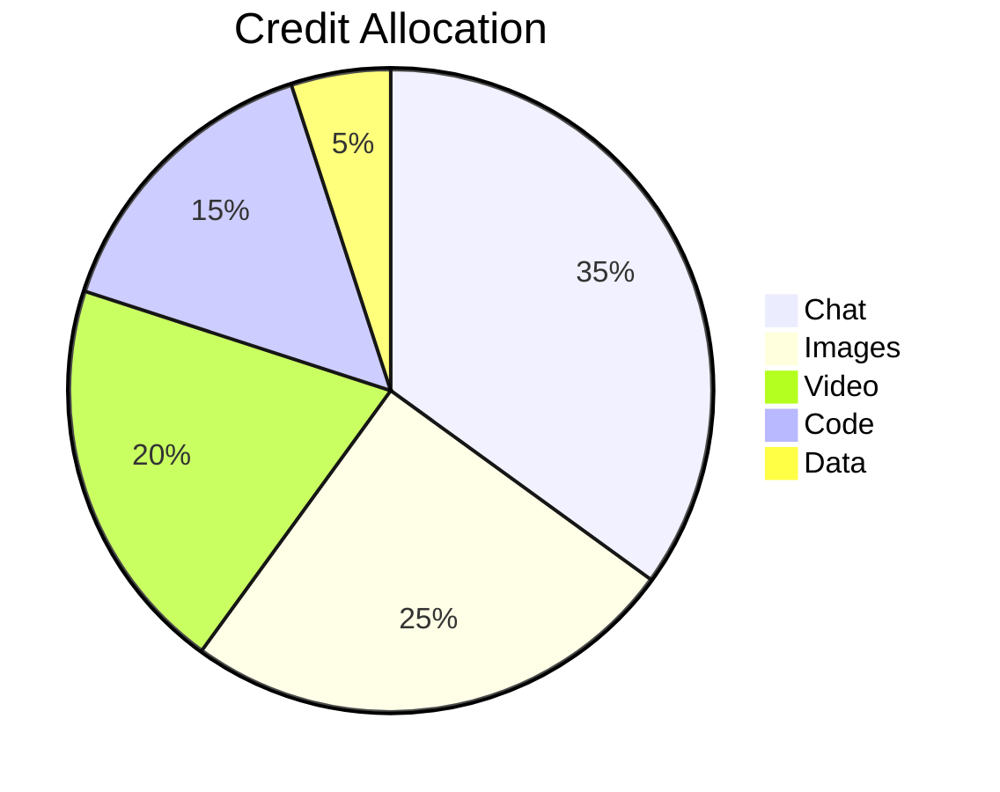
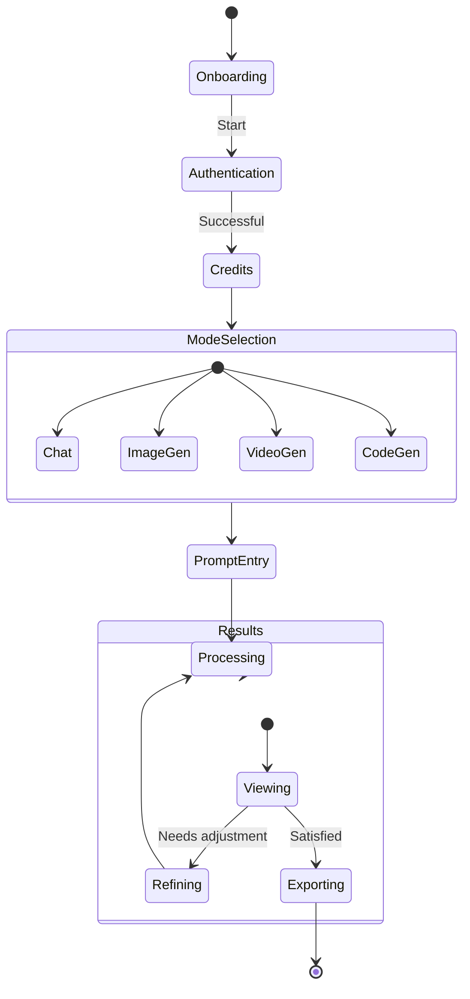

# 🚀 EndVerse AI Android - Next-Gen Multimodal AI App  
[](https://choosealicense.com/licenses/mit/)


The most advanced AI platform combining conversational intelligence, creative generation, and development capabilities in one unified **React Native Android application**.

[](https://reactnative.dev/)
[](https://nodejs.org/)
[](https://expo.dev/)

---

## 🌌 Table of Contents

- [Multimodal Capabilities](#-multimodal-capabilities)
- [Tech Stack](#-tech-stack)
- [System Architecture](#-system-architecture)
- [Installation](#-installation)
- [Usage](#-usage)
- [API Integration](#-api-integration)
- [Credit System](#-credit-system)
- [Security](#-security)
- [Screenshots](#-screenshots)
- [Roadmap](#-roadmap)
- [License](#-license)
- [Support](#-support)

---

## ✨ Multimodal Capabilities

| Feature                | Description                                                              | API Cost  |
| ---------------------- | ------------------------------------------------------------------------ | --------- |
| **💬 Smart Chat**      | Advanced conversational AI with context retention                        | 1 credit  |
| **🎨 Text-to-Image**   | Generate high-quality images from text prompts (DALL-E/Stable Diffusion) | 3 credits |
| **🎥 Text-to-Video**   | Create short video clips from textual descriptions                       | 5 credits |
| **👨‍💻 Code Generation** | Generate, debug, and explain code in multiple languages                  | 2 credits |
| **📊 Data Analysis**   | Process and visualize complex datasets                                   | 2 credits |

---

## 🛠 Tech Stack

**Frontend (Android App)**  
- React Native (Expo / CLI)  
- AsyncStorage (local persistence)  
- React Navigation  
- Axios (API calls)  
- Reanimated & Gesture Handler (UI/UX)  

**Backend (Shared)**  
- Node.js + Express  
- MongoDB Atlas  
- Redis (for caching)  
- Websockets (real-time updates)  

**AI Services**  
- EndVerse Core LLM  
- Stable Diffusion XL (Image)  
- Runway ML (Video)  
- CodeLlama (Programming)  

---

## 🏗 System Architecture

```mermaid
flowchart TD
    A[Mobile App (React Native)] -->|HTTPS| B[API Gateway]
    B --> C[Auth Service]
    B --> D[Chat Service]
    B --> E[Image Service]
    E -->|HTTPS| J[Stable Diffusion]
    B --> F[Video Service]
    B --> G[Code Service]
    C --> H[(MongoDB Users)]
    D --> I[LLM API]
    E --> J[Stable Diffusion]
    F --> K[RunwayML]
    G --> L[CodeLlama]
```

---

## 🚀 Installation (Android App)

**Prerequisites**
- Node.js v18+  
- React Native CLI or Expo CLI installed  
- Android Studio / Emulator OR physical device with USB debugging  
- EndVerse API Keys  

**Steps (Expo Recommended)**

```bash
# Clone repository
git clone https://github.com/201Harsh/EndVerse-AI-Android.git
cd EndVerse-AI-Android

# Install dependencies
npm install

# Configure environment
cp .env.example .env
# Edit .env with your API keys

# Run app on Android
npx expo start
# Press 'a' to launch Android emulator or scan QR code
```

---

## 📱 Usage

1. Open the app on your Android device.  
2. Sign up / log in with your EndVerse account.  
3. Select your modality (Chat, Image, Video, Code, Data).  
4. Enter your prompt and generate.  
5. Save, refine, or export results.  

---

## 🔌 API Integration Examples

- **Text-to-Image Generation (React Native Example)**

```javascript
import axios from "axios";

const generateImage = async (prompt) => {
  const response = await axios.post("https://api.endverse.ai/v1/images", {
    prompt,
    style: "realistic",
    apiKey: process.env.EXPO_PUBLIC_ENDVERSE_IMAGE_KEY,
  });

  return response.data.url;
};
```

- **Code Generation**

```javascript
import axios from "axios";

const generateCode = async (prompt, language) => {
  const response = await axios.post("https://api.endverse.ai/v1/code", {
    prompt,
    language,
    apiKey: process.env.EXPO_PUBLIC_ENDVERSE_CODE_KEY,
  });

  return {
    code: response.data.code,
    explanation: response.data.explanation,
  };
};
```

---

## 💰 Credit System



- New users receive **50 free credits**  
- Subscription plans available  
- Enterprise API access  

---

## 🛡 Security Features

- Secure AsyncStorage for tokens  
- Encrypted API communication (HTTPS)  
- JWT authentication with refresh tokens  
- Rate limiting (100 requests/minute)  
- GDPR compliance tools  

---

## 📈 Roadmap

#### Q3 2024
- Audio generation capabilities  
- Custom AI model fine-tuning  
- Team collaboration features  

#### Q4 2024
- Browser extension integration  
- API marketplace  
- AI agent workflows  

---

# 📃 License  

[](https://choosealicense.com/licenses/mit/)

```text
MIT License

Copyright (c) 2025 Harsh (@201Harsh)

Permission is hereby granted, free of charge, to any person obtaining a copy
of this software and associated documentation files (the “Software”), to deal
in the Software without restriction, including without limitation the rights
to use, copy, modify, merge, publish, distribute, sublicense, and/or sell
copies of the Software, and to permit persons to whom the Software is
furnished to do so, subject to the following conditions:
...
```

---

## 🤝 Contact

- GitHub: https://github.com/201Harsh  
- Email: support@endverse.ai  
- Website: [https://endverse.ai](https://endverse-ai.onrender.com)  
- Instagram: https://www.instagram.com/201harshs/  

---

## 🚀 Getting Started Guide (App Flow)



---

## 🤝 Contributing

- Fork the Project  
- Create your Feature Branch (`git checkout -b feature/AmazingFeature`)  
- Commit your Changes (`git commit -m 'Add some AmazingFeature'`)  
- Push to the Branch (`git push origin feature/AmazingFeature`)  
- Open a Pull Request  

---

## 📮 Contact & Support

- Lead Developer: Harsh (@201Harsh)  
- GitHub : [201Harsh](https://github.com/201Harsh) | Instagram : [201harshs](https://www.instagram.com/201harshs/)  
- Support Portal: support@endgamingai2@gmail.com  

---

## Made With ❤️ in React Native by Harsh
